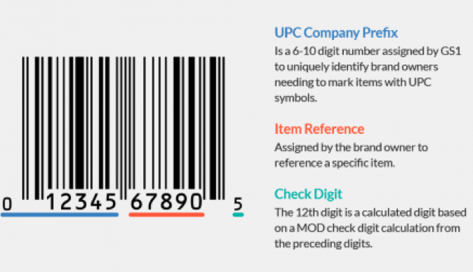

# 2-Choice Hashing
## Due Date: December 4, 2020 11:59pm

Designing a perfect hash function is a non-trivial task. In addition, the performance of a hash function highly depends on the properties of data set. For “separate chaining” hash table, one goal of the hash function is to reduce the maximum length of the linked list among all the table bins.

One simple variant of the above hash table is called “2-choice hashing”, where you use two independent hash functions (h1 and h2) instead of just one. For each object, you will use the two hash functions to give you two choices of positions in the single table. 

**Insert:** With two bins to choose in the table, your strategy is to first check which bin contains the shorter linked list, then insert the new object to the front of that shorter linked list. Otherwise, if two linked lists are of the same length, you insert to the bin returned by your first hash function h1.

**Search:** like insert, you use the two hash functions to find out the two bin locations in the table, you will search both two bins in the table since you won’t know which bin contains your search object. 

**Please note:** the hash table should not contain duplicate objects.
It is possible that two hash functions may sometimes return the same bin position. Then just do insert and search only for that bin. That’s why we want the two hash functions to be independent, so that this won’t happen too regularly. 
For more details on “2-choice hashing”, please refer to https://en.wikipedia.org/wiki/2-choice_hashing

**Data set:** We will use the data file (Grocery_UPC_database.csv) from GitHub repo. You will insert the items in the same order as in the file. Don’t modify this file in any way because your output will depend on that. Here are just some samples from it:

> 773743500068,Beveri Golden Flaxseed Fine Milled With Mixed Berries - 1 Lb   
> 895172001487,Pure Life Shampoo Lavender - 14.9 Fl Oz   
> 773743500051,Beveri Golden Flaxseed Fine Milled With Cranberry - 1 Lb   
> 895172001432,Pure Life Body Lotion Coconut And Mango - 14.9 Fl Oz  

**2-choice hash functions:** Each object contains the UPC number as upc and the description string as desc, we define two independent hash functions:

> `h1(upc) = upc % tableSize `    
> `h2(desc) = abs(desc[0]+27*desc[1]+729*desc[2]) % tableSize`     

We know the first 3 characters (could be number, letter, punctuation, or even space) of the description usually are from the brand of the item, so we expect lots of collisions for h2. We also know the UPC format’s last few digits are independent of brand. So h1 and h2 should be independent from each other. 

**Table size:** Your program will test different table sizes: 1000, 10,000, 100,000. With total around 110,000 items from the data file, if we choose a table of size 100,000, then ideally, we hope to have each bin contains only one or two objects. If table size is 10,000, ideally the bin length should be around 10 for each bin, and so on. Your code will report “standard deviation” (code provided) to describe the difference from the ideal cases.

**Output:**
There are already some sample tests (using test_data.csv) included in the main function. After that, your program will be checked with the full database. It will print 3 standard deviations for 3 different table sizes. Each correct output earns 4 points, total 12 points.
Your program will also print out 18 positions (6 test items for each table size), each correct position earns 1 point, total 18 points
12+18 = 30 point in total.

**How to Submit**
-	You’ll submit your work via GitHub Classroom assignment created by your instructor
-	You’ll receive a link to your assignment via Assignment tool on Canvas
-	After you accept the assignment, you’ll enter the assignment repository on GitHub
-	Click “Clone or Download” and clone the assignment onto your computer
-	After you make changes, commit them. Commits are essentially taking a snapshot of your projects.
-	At some point you'll want to get the updated version of the assignment back onto GitHub, either so that we can help you with your code, or so that it can be graded. You can do this by performing push operation.
-	If you are late in submitting your work, please submit your assignment via CANVAS.

**How to Evaluate**
The following rubric describes how your work will be evaluated. 
Correctness (90 points)
-	[90] Program is correct in object oriented design and function; meets specification
-	[75] Program output is correct but elements of specification missing, e.g. variable/method declarations.
-	[45] Part of the specification has been implemented, e.g. one out of two required subprograms.
-	[20] Program has elements of correct code but does not assemble/compile.
Readability (20 points)
-	[10] Programmer name and assignment present. Sufficient comments to illustrate program logic. Well-chosen identifiers.
-	[7] Programmer name present, most sections have comments. Fair choice of identifiers
-	[5] Few comments, non-meaningful identifiers
-	[0] No programmer name. No comments. Poor identifiers
